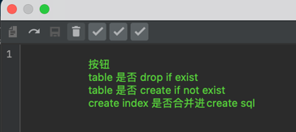

# mysql2h2-plus
借鉴已开源的技术，不断完善转换的IDEA 插件

可以打包后直接拖入IDEA并使用 / 或直接下载 https://github.com/ChenYilei2016/mysql2h2-plus/blob/master/build/distributions

功能:  
1 mysql 转换 h2表结构  
2 兼容索引外部create Index方式  
3 兼容索引表中携带方式  
3 兼容没有分号的情况  
4 兼容h2索引名唯一性  
5 去除create表后的属性  
6 json字段转text  
7 支持 create if not exist , drop if exist选项  
8 支持create索引融合进create表sql中
9 支持适配mysql的虚拟列

